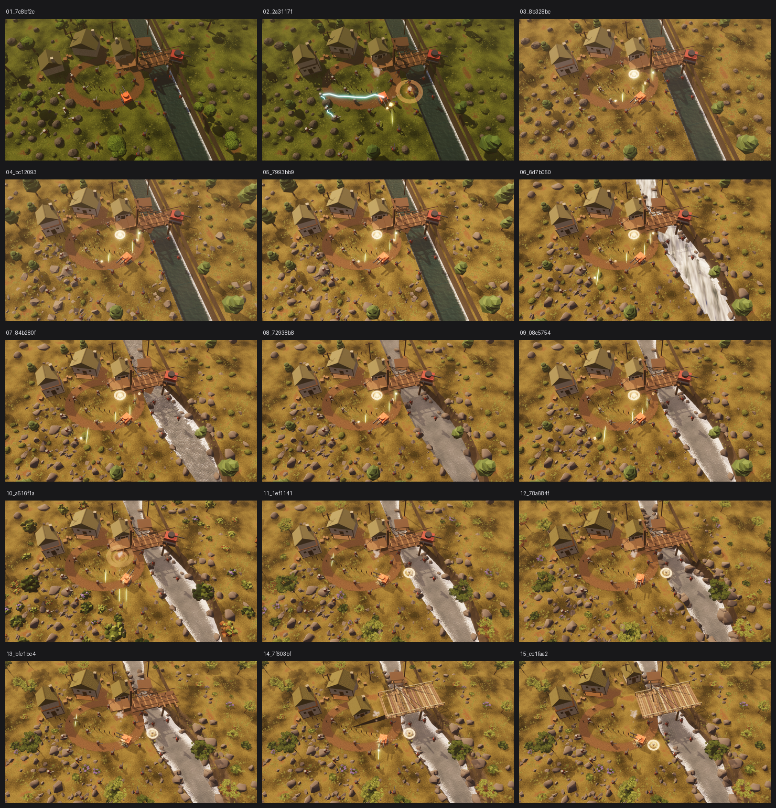

# M2 视觉迭代记录

每一格都是当时那次提交里的 `docs/reference/m2_visual.png`，由 `tools/snapshot_visual.py`
从 git 历史中取出。最新一版始终在 `docs/reference/m2_visual.png`。

拼图总览：

| # | 图 | 提交 | 日期 | 这一版做了什么 |
|---|---|---|---|---|
| 1 | [01_7c8bf2c.png](01_7c8bf2c.png) | `7c8bf2c` | 2026-08-20 | M2 - visual quality |
| 2 | [02_2a3117f.png](02_2a3117f.png) | `2a3117f` | 2026-08-21 | 程序化生成建筑与树资产（Blender），接入正式场景 |
| 3 | [03_8b328bc.png](03_8b328bc.png) | `8b328bc` | 2026-08-21 | 色调校准：按参考图的亮度分布对齐，而不是靠眼睛调 |
| 4 | [04_bc12093.png](04_bc12093.png) | `bc12093` | 2026-08-21 | 石头改用凸包生成；地面凹凸调低（playfield 是平的） |
| 5 | [05_7993bb9.png](05_7993bb9.png) | `7993bb9` | 2026-08-21 | 石头加倒角与按角度平滑；提高方向光/环境光之比 |
| 6 | [06_6d7b050.png](06_6d7b050.png) | `6d7b050` | 2026-08-21 | 河道重做：曲线河道 + 白水急流 + 石头打碎的岸线 |
| 7 | [07_84b280f.png](07_84b280f.png) | `84b280f` | 2026-08-21 | 河道修正：白水做过头了，岸线改用圆柱挖槽 |
| 8 | [08_72938b8.png](08_72938b8.png) | `72938b8` | 2026-08-21 | 水流方向改为顺河道：带状水面 + 顺流 UV |
| 9 | [09_08c5754.png](09_08c5754.png) | `08c5754` | 2026-08-21 | 加回岸边浪花：独立一层 + 修正 UV.x 归一化 |
| 10 | [10_a516f1a.png](10_a516f1a.png) | `a516f1a` | 2026-08-21 | 重做灌木和树木：叶簇堆积代替光滑球体 |
| 11 | [11_1ef1141.png](11_1ef1141.png) | `1ef1141` | 2026-08-21 | 树木灌木改为细枝干 + alpha 贴片叶子 |
| 12 | [12_78a684f.png](12_78a684f.png) | `78a684f` | 2026-08-21 | 河岸打碎 + 表面细节：程序化纹理与法线扰动 |
| 13 | [13_bfe1be4.png](13_bfe1be4.png) | `bfe1be4` | 2026-08-21 | 河岸倒角：CSGPolygon3D 旋转扫掠；立面改用元胞噪声石块纹理 |
| 14 | [14_7f603bf.png](14_7f603bf.png) | `7f603bf` | 2026-08-21 | 桥重做：加宽一倍、Blender 资产带倒角、接入可外部编辑的木纹贴图 |
| 15 | [15_ce1faa2.png](15_ce1faa2.png) | `ce1faa2` | 2026-08-21 | 桥头引桥改成高度场土丘；占位检查补上土坡 |
