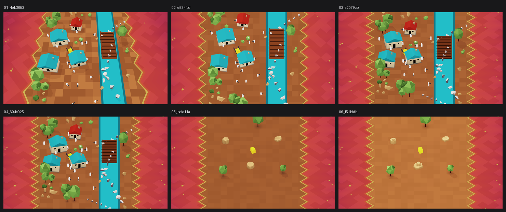

# M2 视觉迭代记录

每一格都是当时那次提交里的 `docs/reference/m2_visual_hellrider.png`，由 `tools/snapshot_visual.py`
从 git 历史中取出。最新一版始终在 `docs/reference/m2_visual_hellrider.png`。

拼图总览：

| # | 图 | 提交 | 日期 | 这一版做了什么 |
|---|---|---|---|---|
| 1 | [01_4eb3653.png](01_4eb3653.png) | `4eb3653` | 2026-08-21 | 新增美术风格 hellrider：极简平面着色低多边形村庄 |
| 2 | [02_e534fcd.png](02_e534fcd.png) | `e534fcd` | 2026-08-21 | hellrider 改用正交相机；修正锯齿相位与方格对比 |
| 3 | [03_a2079cb.png](03_a2079cb.png) | `a2079cb` | 2026-08-21 | hellrider：面内垂直渐变、正交 40° 俯角、修熔岩黑缝 |
| 4 | [04_604c025.png](04_604c025.png) | `604c025` | 2026-08-21 | hellrider：加 blob 阴影（树/石头/房屋下面的软影） |
| 5 | [05_bcfe11a.png](05_bcfe11a.png) | `bcfe11a` | 2026-08-21 | hellrider：石头改成平顶台地；加只有地面+石头+树的调参场景 |
| 6 | [06_f51bfdb.png](06_f51bfdb.png) | `f51bfdb` | 2026-08-22 | hellrider 石头：多层锥台堆叠 + 拉开明暗分面 |
